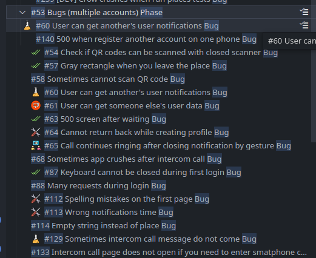
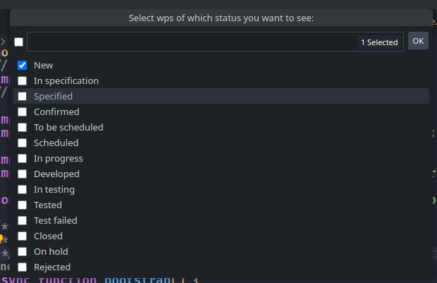
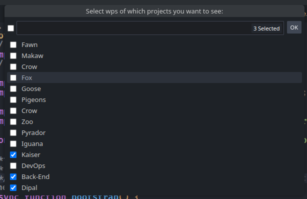
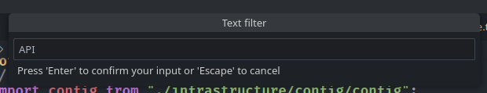
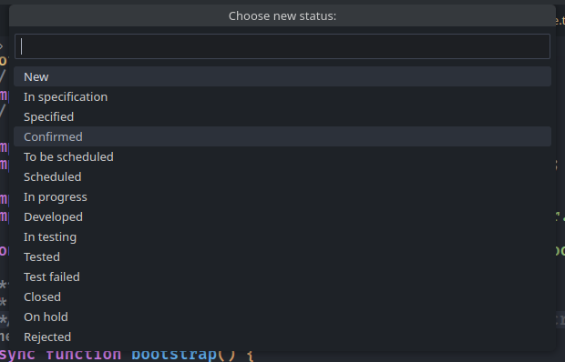

# openproject README

Extension for [OpenProject](https://www.openproject.org/) - project management system.  

## Features

- Getting list of your work packages.
- Filtering your work packages.

- Setting a new status for a work package.

## Requirements

- Your OpenProject url
- Your OpenProject token

## Extension Settings

This extension contributes the following settings:

* `openproject.base_url`: Your OpenProject url.
* `openproject.token`: Your OpenProject access token.

## Release Notes

### 1.0.0

Initial release of OpenProject VSCode extension

### 2.0.0

- Complete refactoring;
- Filtering;
- Set Work Package status command and button;
- Refresh button;
- "Collapse All" button;

**Enjoy!**
